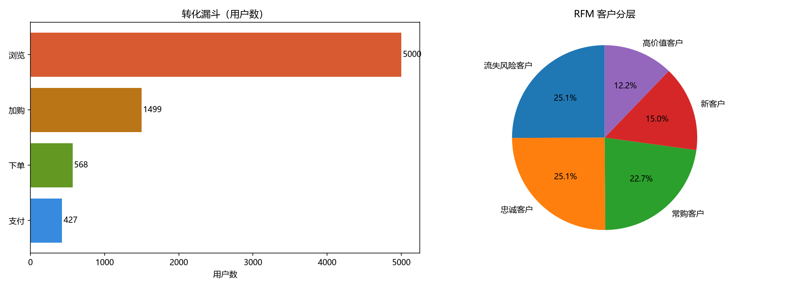
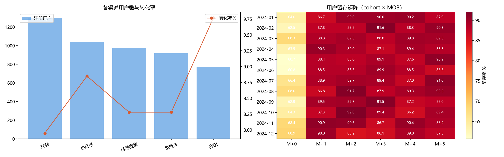

# 电商营销漏斗分析（E-commerce Funnel Analysis）

模拟跨境电商用户行为数据，分析从浏览到支付的转化漏斗、复购率、RFM 客户分层、渠道对比与 cohort 留存。

## 项目背景

跨境电商业务的核心是流量转化效率与用户全生命周期价值。本项目演示了完整的用户行为分析链路：

**多源行为数据 → SQL 提取 → 漏斗 / 复购 / RFM / 渠道 / 留存 → 可视化**

数据为随机生成的模拟数据，包含用户基础属性与四类行为事件（浏览、加购、下单、支付）。

## 技术栈

- **Python 3.13**
- **SQLite**（Python 内置）：数据存储与 SQL 查询（CTE / LEFT JOIN / 窗口函数等）
- **pandas**：数据处理与 cohort 透视
- **matplotlib**：静态可视化
- **Plotly**：交互式 HTML 看板
- **numpy**：辅助计算

## 数据表

```
users（用户表）
├── user_id
├── register_date
├── channel（注册渠道：抖音/小红书/微信/直通车/自然搜索）
└── country（国家）

events（事件表）
├── user_id
├── event_type（browse / add_to_cart / order_created / payment_success）
├── event_time
├── platform（App / Web / MiniProgram）
├── product_id
└── amount
```

## 核心分析维度

| 维度 | 指标 |
|------|------|
| 转化漏斗 | 浏览 → 加购 → 下单 → 支付 各环节用户数与转化率 |
| 复购率 | 支付过 2 次及以上的用户占比 |
| RFM 分层 | 按最近一次支付（R）、频次（F）、金额（M）五等分打分，划分客户层级（高价值/忠诚/常购/新客户/流失风险） |
| 渠道分析 | 各获客渠道的注册用户数与转化率对比 |
| 商品分析 | 商品维度与 SKU 粒度的 GMV 拆解（TOP 商品 / TOP SKU） |
| Cohort 留存 | 按注册月分组，观察各 cohort 在 M+0 ~ M+5 月的活跃率（热力图） |

## 快速开始

```bash
pip install -r requirements.txt
python generate_data.py     # 生成模拟数据到 ecommerce.db
python analysis.py          # 跑全部分析，输出图表到 output/
python interactive_dashboard.py  # 生成交互式看板（本地 output/dashboard.html）
```

## 分析结果示例





## 目录结构

```
ecommerce-funnel-analysis/
├── generate_data.py            # 生成模拟数据（含商品目录）
├── analysis.py                 # 漏斗/复购/RFM/渠道/留存/SKU 分析
├── interactive_dashboard.py    # Plotly 交互式看板
├── requirements.txt
├── ecommerce.db                # 生成的数据（.gitignore 排除）
└── output/
    ├── funnel_rfm.png
    ├── channel_retention.png
    └── report.md
```

## 可扩展方向

- 接入真实数据源（GA4、AppsFlyer、广告平台 API）
- 用 Superset 做企业级交互式 BI
